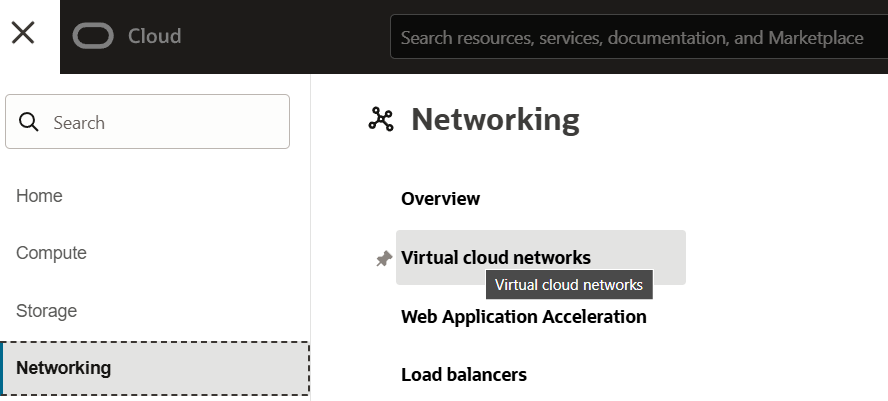
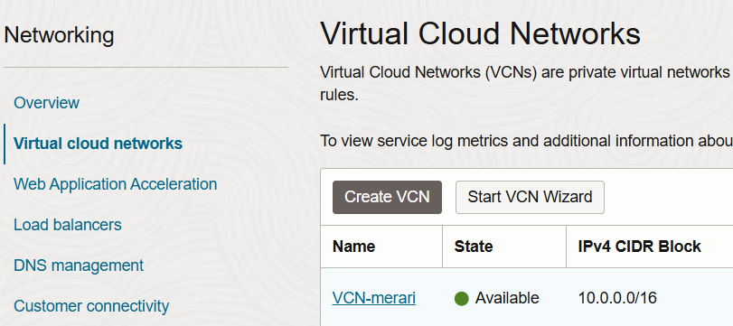
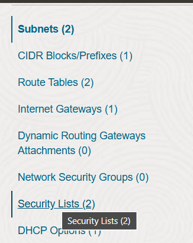
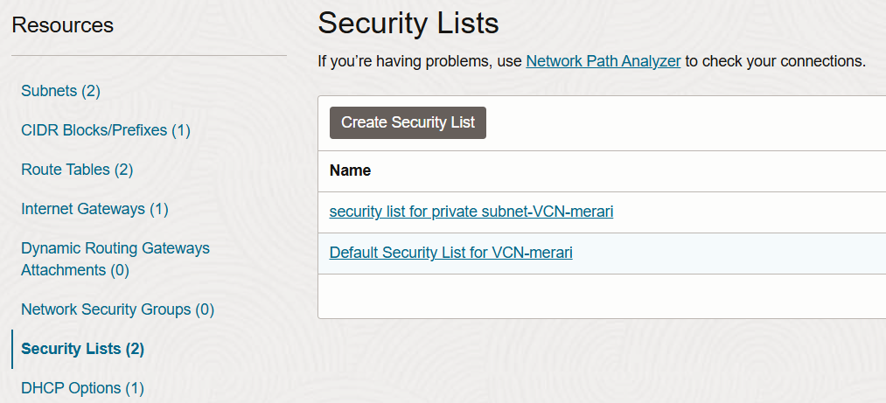
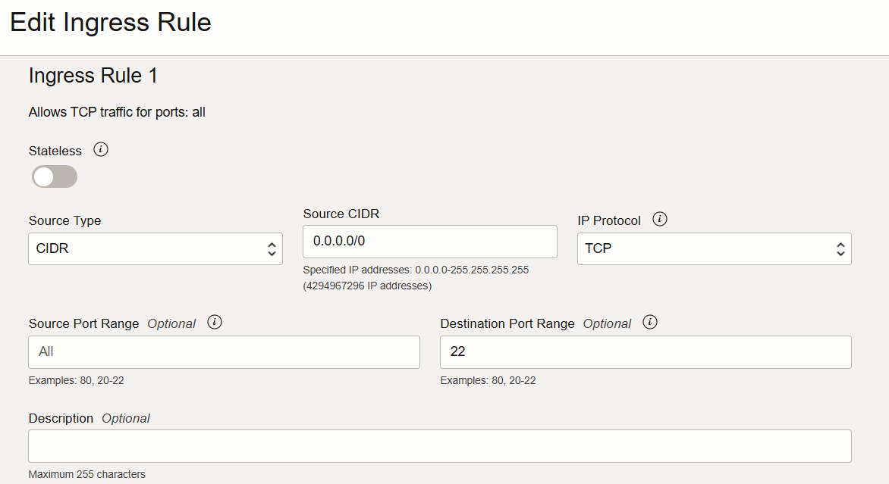
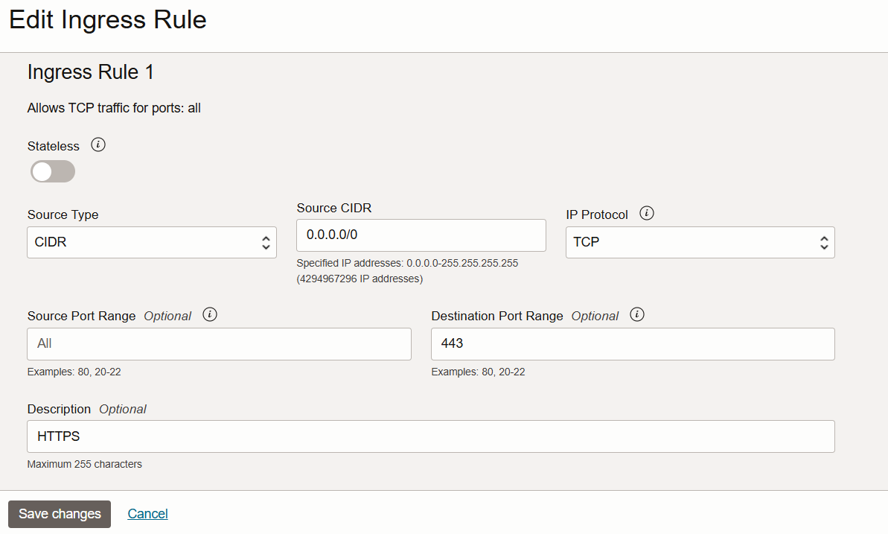

# Gestión de puertos

## 📌 Introducción
Para garantizar la seguridad y correcto funcionamiento de nuestro VPS en **Oracle Cloud**, es fundamental abrir únicamente los puertos necesarios. En este apartado, se habilitaran los puertos en la VPS esenciales como **8083 (Para la consola de Hestia), MySql (3306), HTTP (80), HTTPS (443), SSH (22) y FTP (21)**.

---

## 1. Verificar el Firewall en Oracle Cloud  
Oracle Cloud utiliza **Reglas de Seguridad de VCN** y **Listas de Control de Acceso (ACLs)** para gestionar los puertos abiertos.

### ➤ **Paso 1: Acceder a las reglas de seguridad**
1. Iniciar sesión en **[Oracle Cloud](https://cloud.oracle.com/)**.
2. Ir a **Networking** → **Virtual Cloud Networks (VCN)**.  

3. Seleccionar la VCN asociada a la VPS.  

4. Acceder a **Security Lists** → **Default Security List**.  

  

### ➤ **Paso 2: Agregar reglas de entrada**
Para permitir tráfico, agregar reglas de **Ingress (entrada)**:
| **Protocolo** | **Puerto** | **Origen (CIDR)** | **Descripción** |
|--------------|----------|----------------|----------------|
| SSH | 22 | 0.0.0.0/0 | Acceso remoto seguro |
| HTTP | 80 | 0.0.0.0/0 | Acceso web |
| HTTPS | 443 | 0.0.0.0/0 | Acceso web seguro |
| FTP | 21 | 0.0.0.0/0 | Transferencia de archivos |
| MySql | 3306 | 0.0.0.0/0 | Acceso a la base de datos |
| 8083 | 8083 | 0.0.0.0/0 | Puerto para acceso a Hestia |  

### Ejemplo 1:  

  

### Ejemplo 2:  

