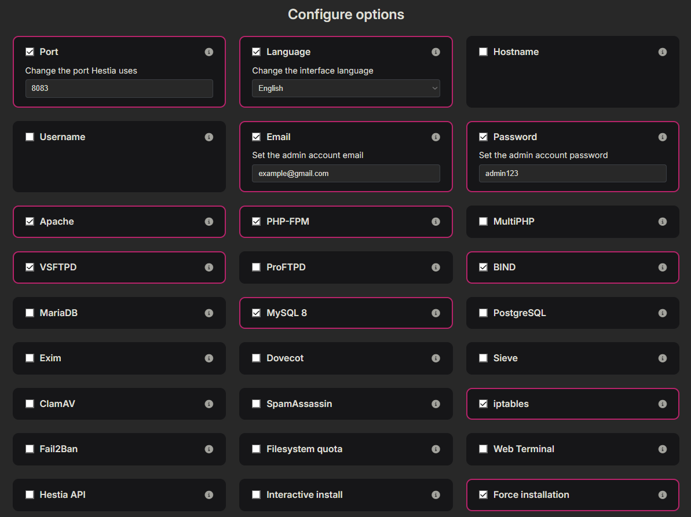
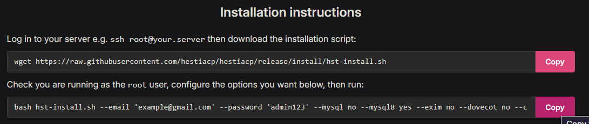
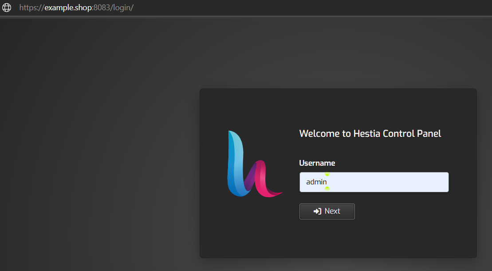
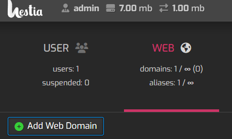
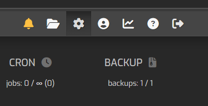
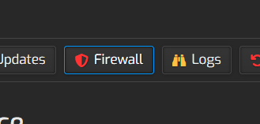
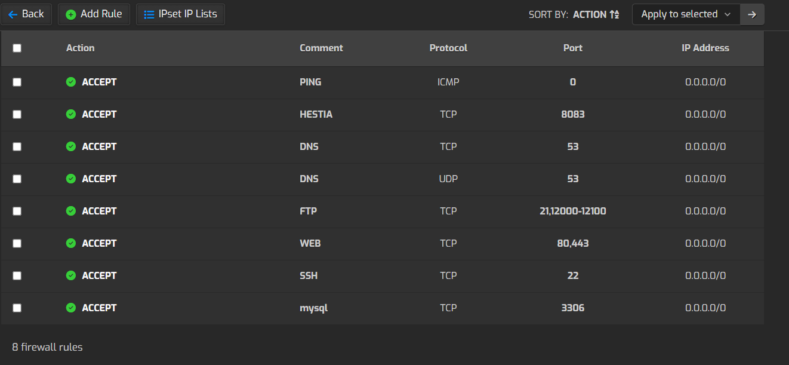

# Configuración del panel en HestiaCP

## 📌 Introducción
Se realizó la creación y configuración del panel de Hestia para el control de nuestro servidor así como para poder añadirle el servicio de la base de datos con PHP que se verá posteriormente. 

## 📂 Contenido
1. **Configuración e instalación**
3. **Configuración del dominio**
4. **Configuración de HTTPS**
5. **Configuración de Firewall**

---

## Configuración e instalación
1. Ir a [Hestia Install](https://hestiacp.com/install) y seleccionar las siguientes opciones para implemertarlas en nuestro servidor:  



2. Una vez configurados los campos anteriores, se proporcionan los comandos a ejecutar en la instancia de **Oracle Cloud** con permisos de `root`.  



---

## Configuración del dominio
1. Una vez instalado Hestia, se ejecutan los siguientes comandos como `root`:
```bash
cd /usr/local/hestia/bin/
v-change-sys-hostname example.shop
v-add-letsencrypt-host
```
---

## Configuración de HTTPS
1. Ir a la ip del servidor en el puerto **8083** e iniciar sesión como administrador.  



2. Ir a la sección de **Web** y añadir un nuevo dominio.  



3. Escribir el nombre del dominio y marcar la opción **Habilitar soporte SSL** además tambien marcar la opción **Usar Let’s Encrypt**.

4. Se comprueba ingresando al dominio pero ahora observando que tiene el "Candado" de seguridad. 

---

## Configuración de Firewall
1. Ir a la configuración, en donde se ilustra con un icono de engranaje.  



2. Seleccionar la opción de **Firewall**.  



3. Seleccionar la opción de **Reglas de entrada**, y crear cada una de las siguientes reglas (sí es que no existen) seleccionando  cada una de las opciones con su respectivo puerto **80**.  


