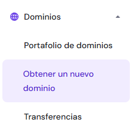
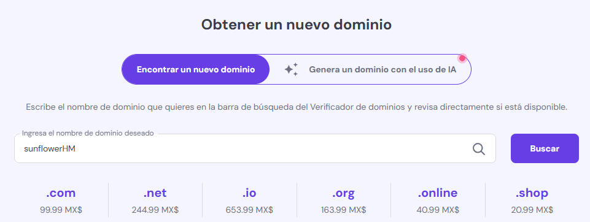
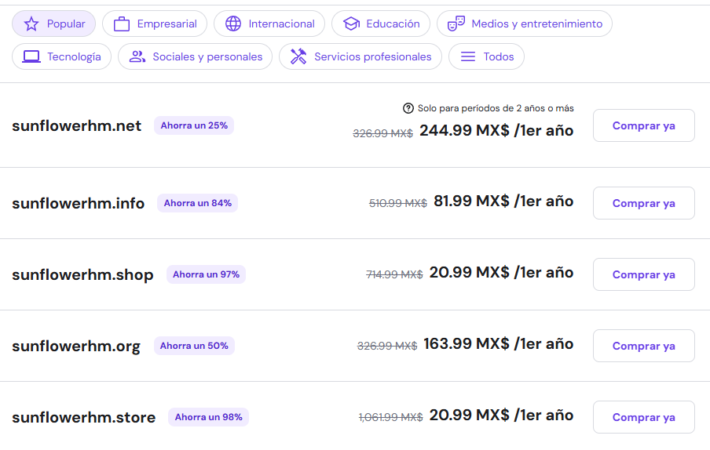
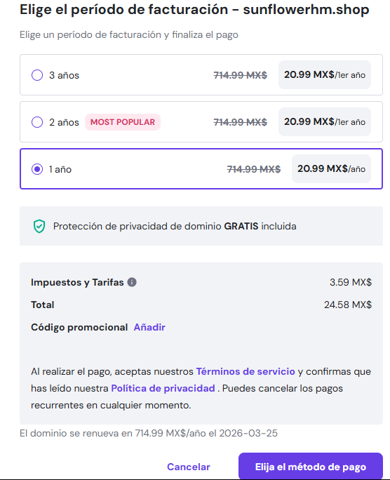
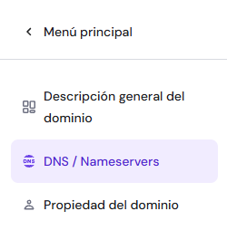
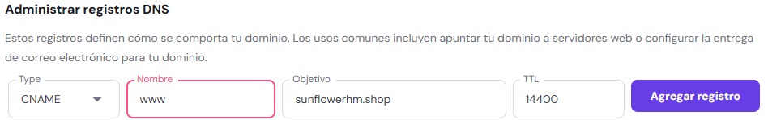
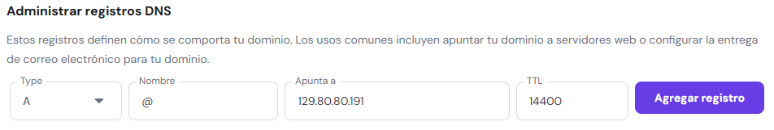

# Configuración de dominio

## 📌 Introducción
Se utlizó la compra de un dominio sencillo para poder configurarlo, esto fue en la plataforma de Hostinger. 

## 📂 Contenido
1. **Compra y configuración**
2. **Configuración del DNS**

---

## Compra y configuración
1. Ir a [Hostinger](https://www.hostinger.com/), crear una cuenta e iniciar sesión.
2. En la sección de **Dominios** seleccionar la opción de **Registrar un nuevo dominio**.  

3. Escribir el nombre deseado del dominio, en la sección de abajo se nos mostrará las diferentes terminaciones que podremos escoger además del costo del dominio.  

  

4. Seleccionar la terminación deseada y proceder a la compra del dominio.  

5. Una vez realizado el pago, se nos mostrará un mensaje de confirmación y se nos redirigirá a la sección de configuración del dominio.

---

## Configuración del DNS
1. Una vez en la sección de configuración del dominio, ir seleccionar la opción de **DNS/Nameservers**.  

2. En la sección de **Administrar registros DNS** primero eliminamos todos los registros, una vez hecho esto añadimos **CNAME** con nombre **www** y en contenido es dominio que acabamos de comprar.  

3. Añadimos un registro **A** con nombre **@** y en contenido es la IP de nuestro servidor.  

