# Instalación de Apache y PHP

## 📌 Introducción
Se realizó la instalación de un servidor web con **Apache** y **PHP** para poder trabajar con una base de datos.  

## 📂 Contenido
1. **Instalación de Apache**
2. **Instalación de PHP**
3. **Ejercicios con PHP**
4. **Postman**
---

## Instalación de Apache
1. Se abre una terminal y se accede a la instancia de *Oracle*.
2. Antes de instalar cualquier paquete, es recomendable actualizar la lista de paquetes. Después realizar la instalación de Apache y PHP.
```bash
sudo apt update && sudo apt upgrade -y
sudo apt -y install apache2
```
3. Verificar su estado con el comando:
```bash
sudo systemctl status apache2
```
Sí este esta inactivo, se inicia con:
```bash
sudo systemctl start apache2
```
4. Verificar que Apache este funcionando correctamente accediendo al dominio con el formato de `example.shop/index.html`.

---

## Instalación de PHP
1. Se instala PHP y sus dependencias.
```bash
sudo apt install php libapache2-mod-php php-cli php-common php-mysql -y
```
2. Se verifica la instalación con el siguiente comando, en donde se debe ver la versión instalada de PHP:
```bash
php -v
```
---

## Ejercicios con PHP

### Kofee y Shop

1. Se tienen los dos siguientes archivos:
- [Index de Kofee](kofee.zip)
- [Index de Shop](shop.zip)
2. Se descomprimen los archivos y se mueven a la dirección de `/var/www/html/`.
3. Sí se realizo correctamente, se puede acceder a la URL `http://IP/kofee` para ver la página así como tambien se puede acceder a la URL `http://IP/shop`.  


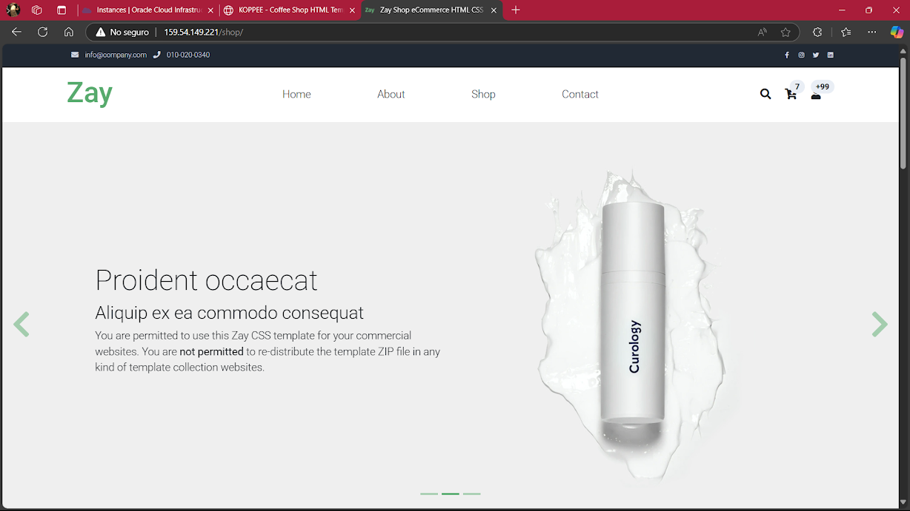

### Conexión con la base de datos y vista de tabla

1. Con la base de datos creada anteriormente con ayuda de HestiaCP, se realizará la verificación de la conexión primero con un archivo `.php`. Antes que nada debemos crear una tabla dentro de la base de datos, esto se hace con ayuda de la interfaz de PHPMyAdmin.
2. Se accede a la dirección `https://example.shop/phpmyadmin/` en donde se debe acceder con las credenciales configuradas en el panel de HestiaCP.  

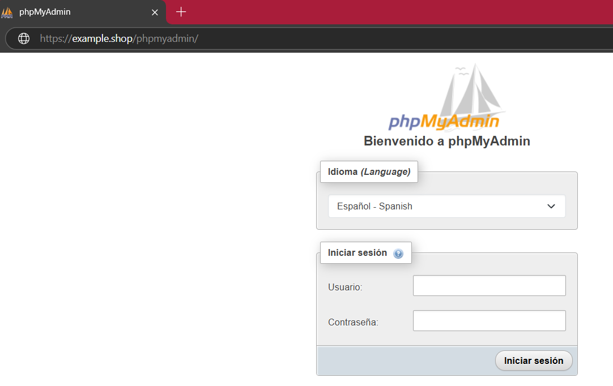

3. Se da clic en **Nueva**, se le da el nombre que deseemos además de que se le crea la tabla de **alumnos** con los campos que se adjuntan a continuación:

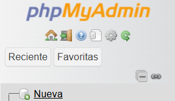

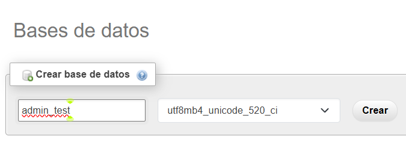

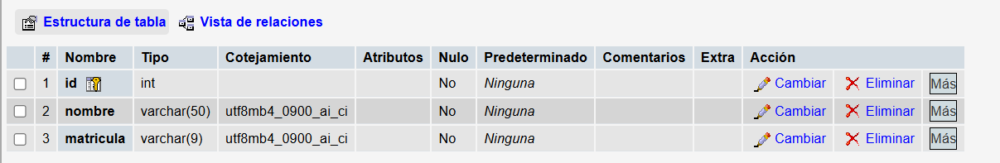

4. Añadimos registros en la base de datos dando clic en la pestaña de **Insertar**.

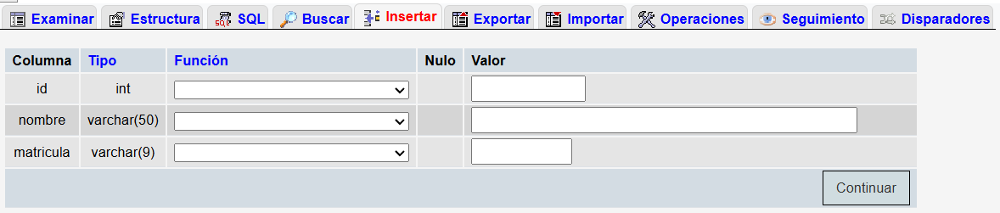

5. Una vez hecho esto, pasamos a nuestra terminal en donde en modo `root` nos dirigimos a la carpeta `/var/www/html/` en donde tendremos que crear/mover los archivos de conexión con la base de datos:
- [Para comprobar la conexión con la base de datos](c1.php)
- [Para ver datos de la tabla deseada de la base de datos](c2.php)
6. Se acceden a los archivos desde el navegador con la dirección `tu-ip-o-dominio/c1.php` o `tu-ip-o-dominio/c2.php`
7. Se debe ver la siguiente pantalla en donde se muestra la conexión con la base de datos y la información de la tabla de la base de datos (dependiendo siempre de la tabla o los datos ingresados en esta misma):

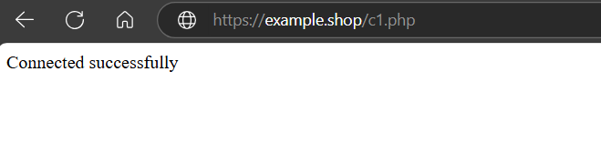

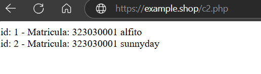

### Insertar datos en una tabla
1. Creamos una nueva tabla dentro de la base de datos pero ahora con los siguientes campos, la nombramos **registro**:

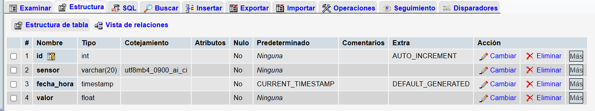

2. Nuevamente, se accede a la carpeta `/var/www/html/` en donde tendremos que crear/mover el archivo para insertar datos:
- [Para insertar datos en la tabla **registro**](c3.php)

3. Insertados varios registros, también podemos verlos con ayuda del siguiente *script*:
- [Para ver los datos insertados en la tabla **registro**](datos.php)

---

## Postman 

### Familiarización con el entorno de Postman 
1. Se detecta el método HTTP de la solicitud que recibe el servidor y responde con el tipo de método utilizado.
2. Se sube el archivo a la carpeta `/var/www/html/`:
- [Para detectar el método utilizado en Postman](r0.php)
3. Se abre Postman y se realiza las pruebas enviando peticiones a la URL de la VPS, se cambia el método HTTP en Postman (GET, POST, PUT).

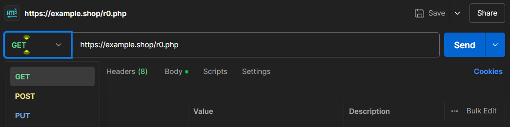

### Insertar datos en la tabla
1. Como en los ejercicios con PHP, primero accedemos a la carpeta `/var/www/html/` en donde tendremos que crear/mover el archivo para recibir datos en formato JSON a través de una solicitud POST:
- [Para insertar datos desde Postman](c4.php)
2. Se accede a la aplicación de Postman y se crea una nueva solicitud de tipo **POST**  

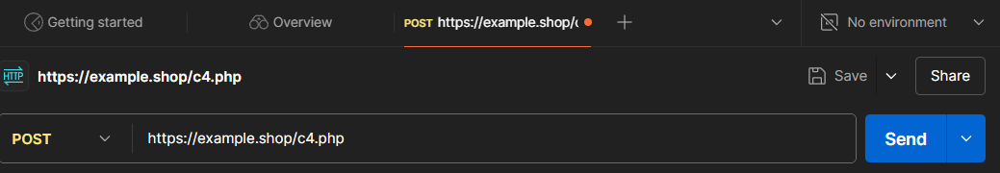

2. Se da clic en **Body** y **raw** en donde se colocan los datos a ingresar en la tabla en formato JSON.

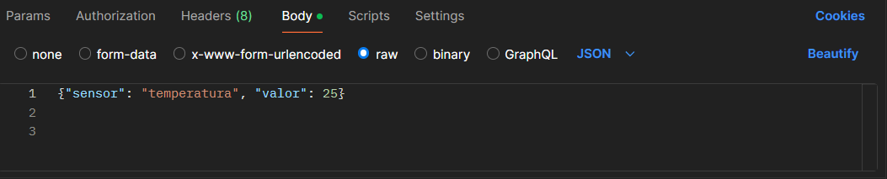

3. Se da clic en **Send** y se debe ver la siguiente pantalla, que es la respuesta de la solicitud en el panel de respuesta de Postman:

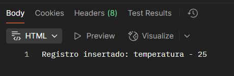

