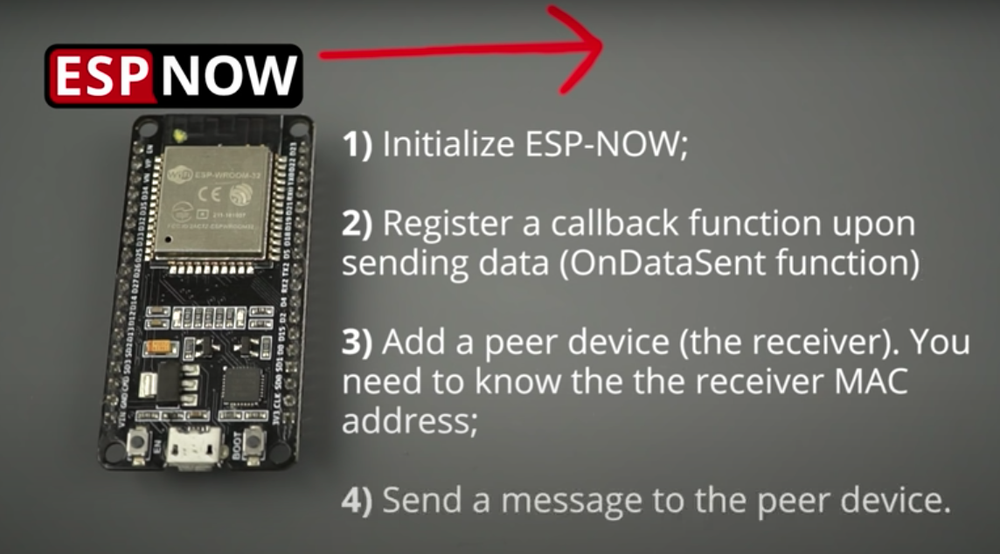
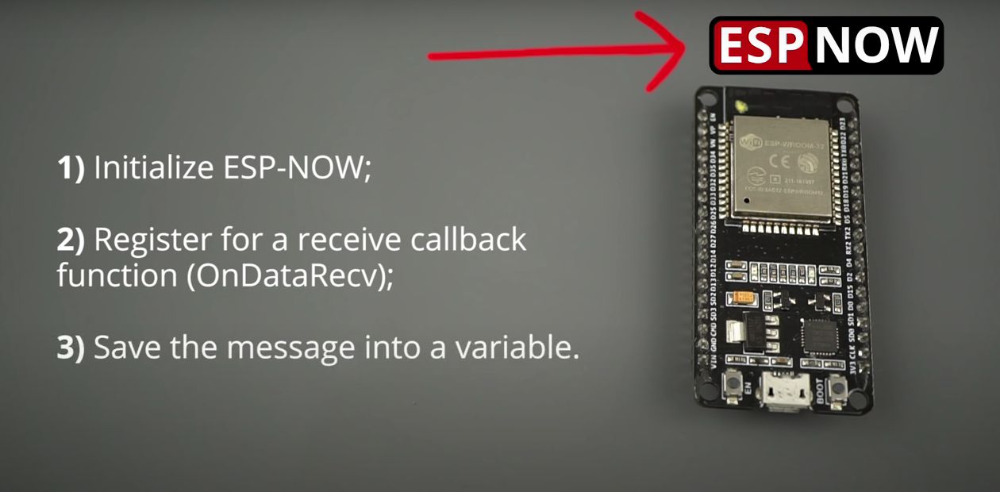

# ESP-NOW
ESP-Now es un protocolo de comunicación entre varios dispositivos creado por Espressif, el cual es similar al utilizado en los dispositivos de baja energía que funcionan en la banda de 2.4Ghz. Su funcionamiento requiere de emparejamiento de los dispositivos, pero una vez hecho la conexión será automática.

- **Maestro:**
1. Obtiene la dirección MAC del esclavo y la guarda.
2. Inicializa ESP-NOW y añade el esclavo como peer (dispositivo receptor).
3. Crea una estructura de datos.
4. Envía los datos cada 2 segundos y verifica si la transmisión fue exitosa.

- **Esclavo:**
1. Se inicializa en modo WiFi STA (requerido para ESP-NOW).
2. Se configura un callback (onReceive) para recibir los datos.
3. Al recibir datos, se copian en la estructura y se imprimen en el Monitor Serial.

## Tipos de comunicación
 
Entre las diferentes configuraciones de las que disponemos para la configuración en una dirección, podemos distinguir las siguientes:

1. Un maestro y un esclavo
2. Un maestro y varios esclavos
3. Varios maestros y un esclavo

## Links de consulta 
1. [Conexión de ESPNOW](https://www.electrosoftcloud.com/esp-now-conecta-dos-o-mas-esp32-esp8266/)
2. [ESP-NOW with ESP32 EXPLAINED: Easiest Wireless Communication Between Boards (ESP8266 Compatible)](https://www.youtube.com/watch?v=qxwXwNS3Avw)
3. [Protocolo de comunicación ESP-NOW (tarjeta ESP32).](https://www.youtube.com/watch?v=sX9pH0OYbKg)
4. [Getting Started with ESP-NOW (ESP8266 NodeMCU with Arduino IDE)](https://randomnerdtutorials.com/esp-now-esp8266-nodemcu-arduino-ide/)
5. [ESP-NOW Two-Way Communication Between ESP32 Boards](https://randomnerdtutorials.com/esp-now-two-way-communication-esp32/)
6. [Que es ESP-NOW?](https://www.electrosoftcloud.com/esp-now-conecta-dos-o-mas-esp32-esp8266/)