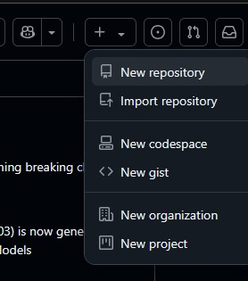
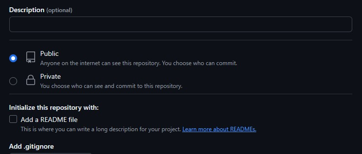
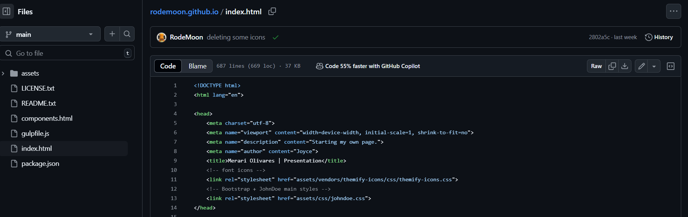
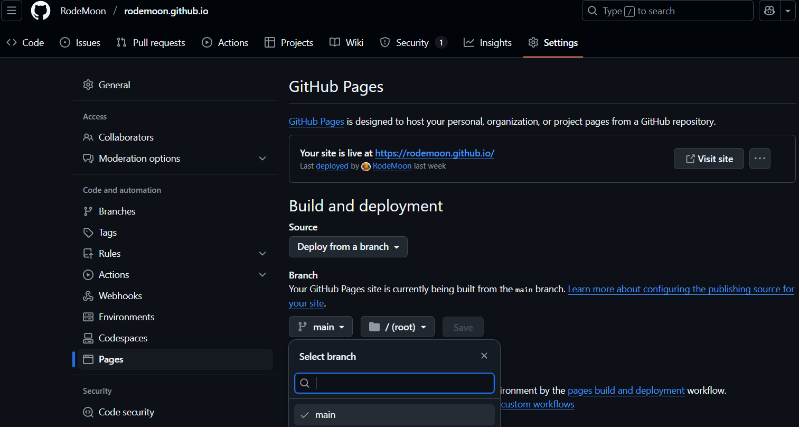

# Git y GitHub
## 📌 Introducción
Se adjuntan los comandos escenciales para el manejo de Git así como la funcionalidad de GitHub implementada con este mismo.

## 📂 Contenido
1. **Guía básica de Git**
2. **Guía básica de GitHub**
3. **Creación de una página web con GitHub**

---
# Guía básica de Git

## 1. Inicializar un repositorio
Para inicializar un repositorio dentro de un directorio/carpeta se hace con el siguiente comando:
```bash
git init
```
Este comando crea un nuevo repositorio de Git en la carpeta actual.

---
## 2. Ver el estado de los archivos
Para ver el estado de los archivos en el repositorio:

```bash
git status
```
Este comando muestra el estado actual de los archivos modificados, así como los archivos que están listos para ser commiteados y cuales no están en el seguimiento de Git.

---

## 3. Agregar archivos a un commit
Para agregar archivos específicos se utilzia el comando:
```bash
git add nombre_archivo
```
Para agregar todos los archivos modificados:

```bash
git add .
```

---
## 4. Crear un commit
Después de agregar los archivos, se puede crear un commit con la siguiente sintaxis:
```bash
git commit -m "Mensaje descriptivo del cambio"
```

---
## 5. Ver el historial
Para ver el historial de commits en el repositorio:
```bash
git log
```
Si lo que se quiere es ver un historial compacto se agregan las siguientes banderas:
```bash
git log --oneline --graph --decorate
```
Estas banderas lo que harán será mostrar en consola la lista de los commits realizados a lo alrgo del tiempo mostrando los primeros digitos del hash, una visualización de las ramas y la descripción del commit en una sola línea.

---

## 6. Crear una rama nueva
Para crear una nueva rama:

```bash
git branch nombre-de-la-rama
```
Para cambiar a esa rama:
```bash
git checkout nombre-de-la-rama
```
O bien se puede usar el siguiente comando:
```bash
git switch nombre-de-la-rama
```
Si lo que se quiere es ahorrar tiempo, es posible crear la rama y moverse a ella agregando solamente la bandera `-b`:

```bash
git checkout -b nombre-de-la-rama
```

---
## 7. Subir cambios a un repositorio remoto
Si el repositorio está enlazado con un repositorio remoto en GitHub, GitLab, etc., los cambios pueden ser enviados con la siguiente sintaxis:
```bash
git push origin nombre-de-la-rama
```

---
## 8. Descargar/Bajar cambios desde el repositorio remoto
Para obtener los cambios más recientes del repositorio remoto sin fusionarlos automáticamente:

```bash
git fetch
```

Para descargar y fusionar cambios automáticamente:

```bash
git pull origin nombre-de-la-rama
```

---
## 9. Fusionar ramas
Si se quiere fusionar los cambios de una rama en `main`:
```bash
git checkout main
git merge nombre-de-la-rama
```

---
## 10. Eliminar una rama
Para eliminar una rama localmente:
```bash
git branch -d nombre-de-la-rama
```
Para eliminar una rama del repositorio remoto:
```bash
git push origin --delete nombre-de-la-rama
```

---

# Guía básica de Github
1. Para crear un nuevo repositorio en la nube se debe localizar la barra superior y del lado derecho identificar la siguiente sección donde yace el símbolo de suma:  


2. Al dar clic se abrirá un menú con las opciones disponibles, dar clic sobre New Repository:  



El único requisito obligatorio para crear un repositorio es darle un nombre, este puede ser cualquiera:  


3. Además, github nos da la posibilidad de agregar una descripción si es necesario, eso dependerá del autor. También nos brinda la opción de editar la visualización del repositorio ya sea público o privado, esto repercutirá en la restricción que le demos al repositorio.  



4. Finalmente se da clic sobre el botón inferior para crear el repositorio:  


5. Por último, para vincular el repositorio local con el repositorio remoto que se ha creado se debe escribir el siguiente comando en consola:
```bash
git remote add origin direccion-del-repositorio
```

---
# Creación de una página web con Github
1. Crear un nuevo repositorio y ponerle el nombre deseado para la página web. 
 
 
 

2. Marcar la opción "Public" para que sea accesible.
3. Activar la opción "Initialize this repository with a README".
4. Clonar el repositorio con:
```bash
git clone https://github.com/usuario/mi-pagina-web.git
cd mi-pagina-web
```
5. Agregar un archivo index.html o buscar alguna plantilla HTML  



6. Subir los archivos con estos comandos:
```bash
git add .
git commit -m "Agregando página inicial"
git push origin main
```
7. Para activar GitHub Pages debemos ir al repositorio en GitHub. Entrar en la pestaña "Settings" y en el menú lateral, seleccionar "Pages". En Branch, elegir main y guardar.  



8. Ahora el sitio estará disponible en:
```bash
https://tu_usuario.github.io/mi-pagina-web/
```
